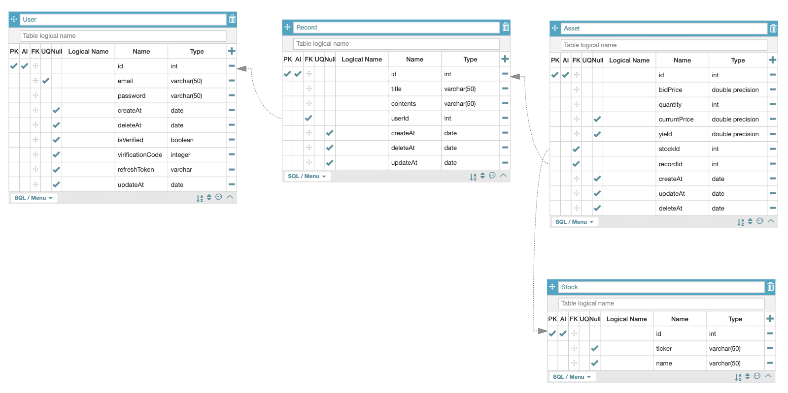

# 투자 기록 서비스

## 1. Description
  >Javascript 기반의 Node.js를 사용하였으며, 프레임워크로는 Nest.js를 사용하였습니다.

  TypeScript을 활용하여 개발시 발생할 수 있는 에러를 런타임 이전에 디버깅 할 수 있다는 이점이 있고, TypeORM을 통해 db와 연결 및 모델간 관계 형성이 용이하다는 장점이 있습니다. 이 두 장점을 활용하기 위해 TypeScript가 기본 내장되어 있는 Nest.js를 사용하기로 결정하였습니다.

  ### 1.1 DataBase
  > 데이터베이스는 postGraphQL을 사용하였습니다. 
  
  주식 데이터 및 투자 기록의 탐색이 잦게 일어나는 서비스 특성상 조회 속도가 빠른 관계형 데이터베이스를 사용하였습니다. 더불어 데이터 수정이 잦게 일어날 경우가 예상돼 여러 컬렉션을 수정해야 하는 NoSQL이 아닌 SQL을 선택하였습니다.

  ### 1.2 API
  > 현재 코드에는 Graphql을 이용한 request 방식이 구현되어 있습니다.

  API의 underfetching overfetching 문제를 해결할 수 있고, API 개수를 줄일 수 있다는 장점이 있기 때문에 사용하였습니다.
  현재 서비스 수준에서는 차이가 크지 않겠지만 만약 depth가 깊은 데이터들을 요청하는 서비스들에서는 그 효용성이 크다 생각하였습니다.

  ### 1.3 Model
  ERD를 사용하여 시각화한 데이터베이스 관계도입니다.
  

***
## 2. Getting Start
  >모든 실행은 rootDir(package.json이 있는)에서 실행됩니다.
  ### 2.1 dev
  Dockerfile을 이용하여 실행 가능합니다.
  
  - 도커 명령어를 통해 container build
  ```docker 
  docker build -t stock-docker . 
  ```
  - build 성공 후 container run
  ``` docker 
  docker run -p 3000:3000 stock-docker
  ```
  이후 로컬 3000번 포트로 접근이 가능합니다.

  ### 2.2 test
  테스트는 jest를 사용하였으며 e2e 테스트를 작성하였습니다.
  이는 도커가 아닌 일반 노드 커맨드로 실행합니다.
  ```
  yarn test:e2e
  ```

***
## 3. API 명세
  ### 3.1 유저 서비스

  #### 3.1.1 유저 생성   
  mutation을 사용하며 input값을 요구합니다.   
  input의 인자는 email과 password가 있습니다.   
  password는 정규식을 통과해야 합니다.  
  특수문자 / 문자 / 숫자 포함 형태의 8~15자리를 요구합니다.
  ```
  mutation{
    createUser(
      input: {
        email: "test@test.com",
        password: "test123!"
      }
    ){
      ok,
      message
    }
  }
  ```

  #### 3.1.2 로그인   
  mutation을 사용하며 input값을 요구합니다.   
  input의 인자는 email과 password가 있습니다.   
  authorization header로 Bearer Token을 요구합니다.
  ```
  mutation{
    createUser(
      input: {
        email: "test@test.com",
        password: "test123!"
      }
    ){
      ok,
      message
    }
  }
  ```
  

  #### 3.1.3 비밀번호 변경을 위한 이메일 전송   
  사용을 위해서는 .dev.env에 gmail 계정과 비밀번호를 설정해야 합니다.
  ```
  mutation{
    EmailForchangePassword(email:"test@test.com"){
      ok,
      statusCode
    }
  }
  ```

  #### 3.1.4 비밀번호 변경
  이메일로 전송된 코드, 이메일, 그리고 새로운 비밀번호를 요구합니다.
  ```
    mutation{
      changePassword(
        email: "test@test.com",
        code: 81865,
        newPassword: "newPassword123!")
      {
        ok,
      error,
      statusCode
      }
    }
  ```

  #### 3.1.5 refreshToken 요구
  로그인시 발급된 리프레쉬 토큰을 이용하여 expire된 엑세스 토큰을 새로 요청하는 endpint입니다.
  authorization header로 Bearer refreshToken을 요구합니다.
  ```
    query{
      refresh{
        ok,
        statusCode,
        access_token
      }
    }
  ```


  ******
  ### 3.2 투자 기록 서비스
  #### 3.2.1 투자 가능 종목 조회
  mutation을 사용합니다.
  ```
    mutation{
      getStocks{
        ok,
        stocks{
          id,
          ticker,
          name,
          price,
          createdAt,
          updatedAt
        }
      }
    }
  ```

  #### 3.2.2 투자 기록 생성   
  mutation을 사용하며 input값을 요구합니다.   
  authorization header로 Bearer Token을 요구합니다.
  ```
  mutation{
    createRecord(input: {
      title: "오늘은 오르길 기대하며",
      contents: "1/21투자 자산",
      assetDetail: [
        {
      	  stock_id: 4,
	        quantity: 10,
 	        bidPrice: 56.8
    	  },
        {
          stock_id: 3,
	        quantity: 10,
 	        bidPrice: 100.36
        }
      ]
    }) {
      ok,
      error,
      statusCode,
      record {
        id,
        userId,
        titile,
        contents,
        assets{
          id,
          stock{
            id,
            name,
            ticker
          },
          bidPrice,
          quantity,
          currentPrice,
          yield
        }
      }
    }
  }
  ```  

  #### 3.2.3 투자 기록 리스트 조회
  유저가 작성한 투자 기록 리스트를 조회하는 endpoint입니다.   
  투자 기록에 속해있는 자산들 또한 조회 가능합니다.   
  authorization header로 Bearer Token을 요구합니다.   
  ```
  query{
    getMyRecords{
      ok,
      error,
      statusCode,
      record{
        id,
        title,
        contents,
        createAt
      }
    }
  }
  ```

  #### 3.2.4 개별 투자 기록 조회
  유저가 작성한 개별 투자 기록을 조회하는 endpoint입니다.   
  투자 기록에 속해있는 자산들 또한 조회 가능합니다.   
  authorization header로 Bearer Token을 요구합니다.
  ```
  query{
    getMyRecord(id:1){
      ok,
      error,
      message,
      statusCode,
      record{
        id,
        title,
        contents,
        createAt,
        userId,
        assets{
          id,
          stock{
            id,
            name,
            ticker
          },
          bidPrice,
          currentPrice,
          yield,
        }
      }
    }
  }
  ```
  #### 3.2.5 투자 기록에 새로운 투자 자산 추가
  존재하는 투자 기록에 투자 자산을 추가하는 endpoint입니다.   
  authorization header로 Bearer Token을 요구합니다.
  ```
  mutation {
    editMyRecord(input: {
        record_id: 1,
        assetDetail: {
          stock_id: 1,
          quantity: 30,
          bidPrice: 1867.07
        }
      }
    ){
      ok,
      error,
      message,
      statusCode,
      record{
        id,
        title,
        contents,
        assets{
          id,
          stock{
            id,
            name,
            ticker
          },
          quantity,
          currentPrice
          yield
        },
        createAt,
        updateAt
      }
    }
  }
  ```

  #### 3.2.6 투자 기록 내 투자 자산 삭제
  authorization header로 Bearer Token을 요구합니다.   
  soft delete 방식으로 삭제합니다.
  ```
  mutation{
    deleteInvestDetail(id: 3){
      ok,
      statusCode,
      error,
      message
    }
  }
  ```

  #### 3.3.7 투자 기록 삭제
  authorization header로 Bearer Token을 요구합니다.   
  soft delete 방식으로 삭제합니다.
  ```
    mutation{
      deleteMyRecord(id: 1){
        ok,
        statusCode,
        error,
        message
      }
    }
  ```


